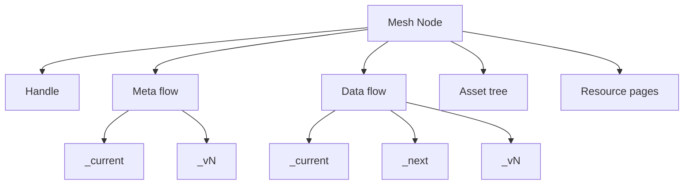

# Semantic Mesh — LLM-Oriented Concept Summary

This document is the canonical, compact context for AIs/LLMs. It summarizes all `documentation/concepts.*` notes and cross-links to authoritative pages.

0) Twin Purposes
- Mint URLs (IRIs) for referring to things on the Semantic Web.
- Hold semantic datasets and supporting resources that use those URLs.

1) Definition
A semantic mesh is a dereferenceable, folder-structured, possibly-versioned corpus of semantic resources where every URL resolves to meaningful content. A mesh maps directly from a Git repository’s folder hierarchy to a published static site so that:
- Every resource is addressable by a stable URL.
- Folder resources are dereferenceable via generated `index.html` resource pages.
- RDF datasets live as distributions on versioned flow snapshots.
- The weave process maintains coherence and keeps the repo publish-ready.

See:
- [[concept.mesh]]: definition, requirements
- [[concept.semantic-site]]: site posture
- [[concept.mesh-repo]]: repo-to-site mapping

2) Design Principles
- [[principle.dereferencability-for-humans]]: resource pages
- [[principle.single-referent]]: concept vs content is explicit
- [[principle.pseudo-immutability]]: treat version snapshots/IDs as immutable
- [[principle.transposability]]: move meshes without breaking links via relative IDs
- [[principle.composability]]: extract/compose submeshes

3) Core Abstractions

3.1 Mesh Resources (Nodes and Components)
- Node (folder; container for nodes & components): [[concept.mesh.resource.node]]
  - bare node: organizational URL segment container: [[concept.mesh.resource.node.namespace]]
  - data node: URL refers to the node’s referent (real-world entity or dataset concept); has a data flow: [[concept.mesh.resource.node.data]]
  - Dataset-series specialization (optional): [[concept.mesh.resource.node.data.series]]

- Node component (terminal resource supporting a node): [[resource.node-component]]
  - Flows (abstract datasets as DatasetSeries):
    - Meta flow (metadata/provenance): [[resource.node-component.flow.node-metadata]]
    - Data flow (payload data): [[resource.node-component.flow.data]]
    - Node-config flows (settings; see §9): [[resource.node-component.flow.node-config]]
  - Flow snapshots (concrete Datasets): `_current/`, `_next/`, `_vN/`
    - Overview: [[resource.node-component.flow-snapshot]]
    - `_current/`: [[resource.node-component.flow-snapshot.current]]
    - `_next/`: [[resource.node-component.flow-snapshot.next]]
    - `_vN/`: [[resource.node-component.flow-snapshot.version]]
    - Distributions: [[resource.node-component.flow-snapshot.distribution]]
  - Handle (refer to the node “as a mesh resource”): [[resource.node-component.node-handle]]
    - Handle page (human-facing): [[resource.node-component.handle.page]]
  - Asset tree (static files for the node): [[resource.node-component.asset-tree]]
  - Documentation resources (README/CHANGELOG/resource pages/fragments):
    - README: [[resource.node-component.documentation-resource.readme]]
    - CHANGELOG: [[resource.node-component.documentation-resource.changelog]]
    - Resource page (index.html): [[resource.node-component.documentation-resource.resource-page]]
    - Resource fragment: [[resource.node-component.documentation-resource.resource-fragment]]
  - Aggregated distribution (optional roll-up of child node data): [[resource.node-component.aggregated-distribution]]

3.2 Facets (Folder, File, Dataset)
- Folder facet (namespace mapping; reserved folders): [[concept.mesh.resource-facet.folder]]
- File facet (content retrieval): [[concept.mesh.resource-facet.file]]
- Dataset facet (DatasetSeries vs Dataset): [[concept.mesh.resource-facet.dataset]]

4) Addressing and Identity

4.1 Namespace and Relative Identifiers
- Folder names become namespace segments; the path is the node’s relative identifier (and URL path when published).
- Relative identifiers are used within distributions for transposability; resolve relative to distribution location.
See:
- [[concept.namespace]]: overview
- [[concept.namespace.segment]]: segment definition
- [[concept.namespace.segment.system]]: reserved segments
- [[concept.identifier.intramesh]]: relative IDs

4.2 URL Semantics
- Concept URLs (slash-terminated) identify nodes, flows (abstract), snapshots (conceptual), and handle.
- Content URLs (with filenames) identify retrievable files: distributions, HTML pages, READMEs, assets.
- Follow document-vs-thing hygiene to avoid ambiguity.
See:
- [[concept.identifier]]: URL types and mapping
- [[faq.reference-iri-choices]]: trade-offs
- [[concept.iri]]: terminology; prefer “URLs” when referring to mesh-local IRIs

4.3 Handle Rationale
- A node’s URL refers to its referent (namespace, real-world entity, or dataset concept).
- The handle component provides a URL to refer to the node itself “as a mesh resource” (for config, provenance, lifecycle).
See:
- [[resource.node-component.node-handle]]
- [[resource.node-component.handle.page]]

5) Physical Structure and Reserved Folders

Reserved folder names (underscore-prefixed; canonical set):
- `_node-handle/`
- Flow containers (abstract datasets):
  - `_meta-flow/`, `_data-flow/`
  - `_config-operational-flow/`, `_config-inheritable-flow/` (see §9)
- Snapshots inside a flow:
  - `_current/`, `_next/`, `_vN/` (e.g., `_v1/`, `_v2/`, …)
- Assets:
  - `_assets/` (static files)

Folder-note pages for these reserved names live under `concept.mesh.resource.folder.*.md` (where defined):
- `_meta-flow/`: [[concept.mesh.resource.folder._meta-flow]]
- `_data-flow/`: [[concept.mesh.resource.folder._data-flow]]
- `_config-operational-flow/`: [[concept.mesh.resource.folder._config-operational-flow]]
- `_config-inheritable-flow/`: [[concept.mesh.resource.folder._config-inheritable-flow]]
- `_current/`: [[concept.mesh.resource.folder._current]]
- `_next/`: [[concept.mesh.resource.folder._next]]
- `_vN/`: [[concept.mesh.resource.folder._vN]]
- `_assets/`: [[concept.mesh.resource.folder._assets]]
- Node folder pages:
  - Node: [[concept.mesh.resource.folder.node]]
  - Namespace: [[concept.mesh.resource.folder.namespace]]

6) Data and Versioning Model
- Only flows are versioned (flows are DatasetSeries). Nodes are not versioned.
- Flow snapshots:
  - `_current/`: latest stable realization; after weave it equals the content of the latest `_vN/`.
  - `_next/`: mutable working area.
  - `_vN/`: immutable history for precise citation and provenance.
- Working distribution: `_next/` typically contains a single editable source; weave can fan-out serializations.
- Sibling distribution: patterns and constraints for multi-file realizations.
See:
- [[concept.versioning]]
- [[concept.working-distribution]]
- [[concept.sibling-distribution]]

7) Lifecycle and Weave Process
Weave maintains structural coherence and publication readiness:
- Ensures required system components exist.
- If versioning is enabled, creates a new `_vN/` from `_next/`.
- Promotes `_next/` contents to `_current/`.
- Updates meta/provenance; regenerates resource pages.
- Resolves internal links to maintain transposability.
- Integrates with the scanner where applicable.
See:
- [[concept.weave-process]]
- [[concept.flow.page-generation]]
- [[concept.scanner]]
- [[concept.metadata.provenance]]

8) Publishing and Sites
- Repos are static-site-ready; pushing to GitHub Pages or any static host publishes the mesh (folder paths → URL paths).
- Transposition (domain/project move) is safe with relative IDs.
See:
- [[concept.mesh-repo]]
- [[concept.semantic-site]]
- [[concept.publication]]

1) Configuration and Inheritance (Two Config Flows)
- Operational Config Flow: final, resolved settings for a node (consumer). Overrides apply here.
- Inheritable Config Flow: settings a node offers to descendants (provider). Property-level merge; order: parent → … → service → platform; propagation can be firewalled.
- Resolution: a single inheritance mechanism resolves operational config from inheritable configs plus service/platform defaults. Explicit operational entries override inherited ones.
See:
- [[resource.node-component.flow.node-config]]: overview
- [[resource.node-component.flow.node-config.operational]]
- [[resource.node-component.flow.node-config.inheritable]]
- [[resource.node-component.node-config-defaults]]: defaults as inheritable values

1)  Aggregated Views
- Aggregated distribution: optional roll-up of child data nodes’ current datasets at a parent node for convenience.
See:
- [[resource.node-component.aggregated-distribution]]

1)  Minimal File Tree Example

```
/repo-root/
├── _assets/                         # optional site-wide assets
├── my-node/                         # a mesh node (folder)
│   ├── _node-handle/                # handle component (resource.node-component.node-handle)
│   ├── _meta-flow/                  # metadata flow (system)
│   │   ├── _current/
│   │   └── _v1/
│   ├── _data-flow/                  # data flow (for data nodes)
│   │   ├── _current/
│   │   ├── _next/
│   │   └── _v1/
│   ├── _config-inheritable-flow/    # provider config (optional)
│   ├── _config-operational-flow/    # resolved config (optional; may be system-written)
│   ├── index.html                   # resource page
│   ├── README.md
│   └── CHANGELOG.md
└── docs/ or public host mapping     # publication target
```

12) Visual Overview



13) Glossary
- [[concept.mesh]]: the set of addressable resources in a repository, published as a site
- Node: an extensible folder resource containing nodes/components: [[resource.node]]
- Node component: terminal resource that supports node behavior/structure: [[resource.node-component]]
- Flow: DatasetSeries representing an abstract dataset (meta/data/config): [[resource.node-component.flow]]
- [[resource.node-component.flow-snapshot]]: concrete Dataset realization of a flow (`_current/`, `_next/`, `_vN/`)
- [[resource.node-component.snapshot-distribution]]: a concrete serialization file (TriG, JSON-LD, etc.): 
- Handle: indirection to refer to the node “as a mesh resource”: [[resource.node-component.node-handle]]
- Resource Page: dereferenceable `index.html` for folders: [[resource.node-component.documentation-resource.resource-page]]
- Aggregated Distribution: parent-level roll-up of children’s current data: [[resource.node-component.aggregated-distribution]]
- Weave: lifecycle operation to version/promote/regenerate/repair: [[concept.weave-process]]
- Evidence:
  - TriG appears unsupported while docs/examples use TriG heavily: [[resource.node-component.flow-snapshot.distribution]]
- Recommendation: Make TriG and JSON-LD first-class supported formats; document status for TTL, N-Quads, RDF/XML.

K. Config defaults doc should include explicit property names/shapes
- Evidence:
  - [[resource.node-component.node-config-defaults]] lacks concrete JSON-LD terms/examples
- Recommendation: Provide explicit terms/shapes aligned with config-flow vocabulary and the inheritance resolution doc.

L. Relative identifier examples mention `_config-flow`
- Evidence:
  - [[concept.identifier.intramesh]] vs config docs (two config flows): [[resource.node-component.flow.node-config]]
- Recommendation: Align examples with `_config-operational-flow/` and `_config-inheritable-flow/`.

M. Confirm embedded mesh doc and folder-note coverage
- Evidence:
  - [[concept.mesh.embedded]] exists; ensure it’s linked where appropriate (namespace/base docs).
- Recommendation: Link embedded mesh doc from base/namespace docs.

1)  Minimal “Core Context” to feed an LLM
If context must be small, include:
- Definition (§1) and Principles (§2).
- Node vs Component; Flows vs Snapshots (§3).
- URL semantics and relative identifiers (§4).
- Reserved folders and example tree (§5, §11).
- Lifecycle and weave (§7).
- Config flows model (§9).
- Aggregated views (§10).

1)  LLM Usage Notes
- Use the folder names and URL semantics exactly as standardized here.
- When encountering contradictions, prefer the standards in §14 recommendations.
- When linking within the mesh, prefer relative identifiers to maintain transposability.
- Avoid “IRI/URI” unless drawing a distinction; for mesh-local identifiers, use “URLs”.
