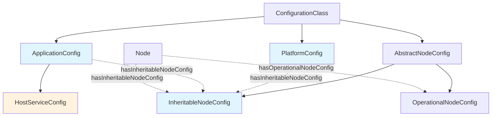

# Merge sflo-host and sflo-config Ontologies

## Prompt
Merge the sflo-config ontology and the sflo-host ontology, or perhaps just move some classes like ServiceConfig, PlatformServiceConfig.

## TODO
- [x] Analyze what needs to move from sflo-host to sflo-config
- [x] Identify questions that need clarification before merge
- [x] Plan the merge structure
- [x] Document the planned changes
- [x] Execute the merge

## Decisions

### Configuration Hierarchy
- Three levels of config: Platform, Application/Service, and Node
- Each level can have inheritable config that flows down to lower levels
- Inheritable config is primarily useful at platform and application levels, but nodes can also provide it

### Class Naming
- Rename `PlatformServiceConfig` → `PlatformConfig`
- Rename `ServiceConfig` → `ApplicationConfig`
- Create new `HostServiceConfig` in sflo-host that extends `ApplicationConfig`

## Merge Plan

### What Moves to sflo-config

#### Classes
1. **PlatformConfig** (formerly PlatformServiceConfig)
   - Represents platform-wide defaults
   - Links to InheritableNodeConfig for platform-level defaults
   
2. **ApplicationConfig** (formerly ServiceConfig)
   - Represents application/service-level configuration
   - Links to InheritableNodeConfig for application-level overrides
   
3. **defaultPlatformConfig** (formerly defaultPlatformServiceConfig)
   - The canonical platform defaults instance
   - Contains embedded defaultInheritableNodeConfig

#### Properties to Move
None - keep application properties in sflo-host

### What Stays in sflo-host

#### Classes
1. **HostServiceConfig** (new, extends ApplicationConfig)
   - Concrete implementation for sflo-host application
   - Inherits configuration hierarchy capabilities from ApplicationConfig
   
2. **LoggingConfig**
3. **LogChannelConfig**  
4. **ContainedServicesConfig**
5. **MeshPath**

#### Properties (on HostServiceConfig)
- `port`, `host`, `scheme`
- `meshPaths`
- `hasLoggingConfig`
- `hasContainedServices`

### Updated Class Hierarchy

Blue = sflo-config ontology
Orange = sflo-host ontology

### Reference Updates

#### In sflo-config
- Update `hasInheritableNodeConfig` domain to include:
  - `PlatformConfig` (instead of sflo-host:PlatformServiceConfig)
  - `ApplicationConfig` (instead of sflo-host:ServiceConfig)
  - `sflo:Handle` (unchanged)

#### In sflo-host  
- Change references from `sflo-host:ServiceConfig` to `sflo-config:ApplicationConfig`
- Update HostServiceConfig to extend `sflo-config:ApplicationConfig`
- Update namespace prefixes to import sflo-config

### Benefits of This Approach

1. **Clean Separation**: Config inheritance hierarchy in one place, application specifics in another
2. **No Circular Dependencies**: sflo-config doesn't reference sflo-host
3. **Extensibility**: Other applications can extend ApplicationConfig with their own specifics
4. **Clear Inheritance Chain**: Platform → Application → Node hierarchy is explicit

## Implementation Summary

### Changes Made to sflo-config

1. **Added new classes:**
   - `PlatformConfig` - Platform-wide configuration with inheritable defaults
   - `ApplicationConfig` - Application/service-level configuration
   
2. **Added default instance:**
   - `defaultPlatformConfig` - Canonical platform defaults with embedded `defaultInheritableNodeConfig`
   
3. **Updated property domains:**
   - `hasInheritableNodeConfig` now accepts `PlatformConfig` and `ApplicationConfig` (instead of sflo-host classes)

### Changes Made to sflo-host

1. **Removed classes:**
   - `ServiceConfig` (moved to sflo-config as `ApplicationConfig`)
   - `PlatformServiceConfig` (moved to sflo-config as `PlatformConfig`)
   
2. **Added new class:**
   - `HostServiceConfig` - Extends `sflo-config:ApplicationConfig` with host-specific properties
   
3. **Removed instance:**
   - `defaultPlatformServiceConfig` (moved to sflo-config as `defaultPlatformConfig`)
   
4. **Updated all property domains:**
   - Changed from `ServiceConfig` to `HostServiceConfig`
   
5. **Added ontology import:**
   - `owl:imports` pointing to sflo-config ontology

### Result

The configuration hierarchy is now cleanly separated:
- **sflo-config**: Contains the abstract configuration inheritance model (Platform → Application → Node)
- **sflo-host**: Contains concrete application-specific implementation (HostServiceConfig extends ApplicationConfig)

This allows other applications to extend `ApplicationConfig` with their own specific properties while reusing the core configuration inheritance mechanism.
