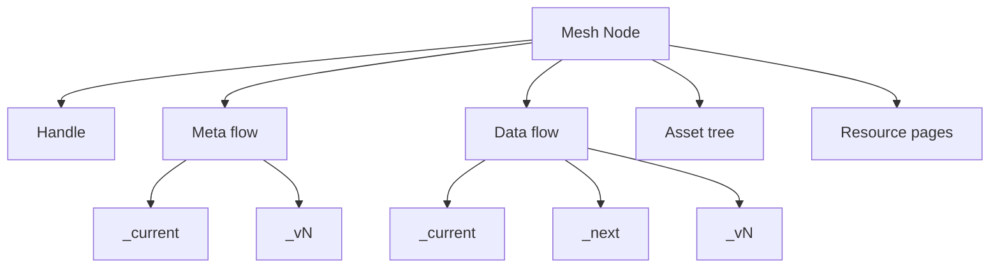

# Semantic Mesh — LLM-Oriented Concept Summary

This document is the canonical, compact context for AIs/LLMs. It summarizes all `documentation/concepts.*` notes and cross-links to authoritative pages.

0) Twin Purposes
- Mint URLs (IRIs) for referring to things on the Semantic Web.
- Hold semantic datasets and supporting resources that use those URLs.

1) Definition
A semantic mesh is a dereferenceable, folder-structured, possibly-versioned corpus of semantic resources where every URL resolves to meaningful content. A mesh maps directly from a Git repository’s folder hierarchy to a published static site so that:
- Every resource is addressable by a stable URL.
- Folder resources are dereferenceable via generated `index.html` resource pages.
- RDF datasets live as distributions on versioned flow snapshots.
- The weave process maintains coherence and keeps the repo publish-ready.

See:
- concept.mesh (definition, requirements): documentation/concept.mesh.md
- concept.semantic-site (site posture): documentation/concept.semantic-site.md
- concept.mesh-repo (repo-to-site mapping): documentation/concept.mesh-repo.md

2) Design Principles
- Dereferenceability for humans (resource pages): documentation/principle.dereferencability-for-humans.md
- Single referent per URL (concept vs content is explicit): documentation/principle.single-referent.md
- Pseudo-immutability (treat version snapshots/IDs as immutable): documentation/principle.pseudo-immutability.md
- Transposability (move meshes without breaking links via relative IDs): documentation/concept.transposability.md
- Composability (extract/compose submeshes): documentation/concept.composability.md

3) Core Abstractions

3.1 Mesh Resources (Nodes and Elements)
- Node (folder; container for nodes & elements): documentation/concept.mesh.resource.node.md
  - Namespace node: organizational URL segment container: documentation/concept.mesh.resource.node.namespace.md
  - Data node: URL refers to the node’s referent (real-world entity or dataset concept); has a data flow: documentation/concept.mesh.resource.node.data.md
  - Dataset-series specialization (optional): documentation/concept.mesh.resource.node.data.series.md

- Element (terminal resource supporting a node): documentation/concept.mesh.resource.element.md
  - Flows (abstract datasets as DatasetSeries):
    - Meta flow (metadata/provenance): documentation/concept.mesh.resource.element.flow.metadata.md
    - Data flow (payload data): documentation/concept.mesh.resource.element.flow.data.md
    - Config flows (settings; see §9): documentation/concept.mesh.resource.element.flow.config.md
  - Flow snapshots (concrete Datasets): `_current/`, `_next/`, `_vN/`
    - Overview: documentation/concept.mesh.resource.element.flow.snapshot.md
    - `_current/`: documentation/concept.mesh.resource.element.flow.snapshot.current.md
    - `_next/`: documentation/concept.mesh.resource.element.flow.snapshot.next.md
    - `_vN/`: documentation/concept.mesh.resource.element.flow.snapshot.version.md
    - Distributions: documentation/concept.mesh.resource.element.flow.snapshot.distribution.md
  - Handle (refer to the node “as a mesh resource”): documentation/concept.mesh.resource.element.handle.md
    - Handle page (human-facing): documentation/concept.mesh.resource.element.handle.page.md
  - Asset tree (static files for the node): documentation/concept.mesh.resource.element.asset-tree.md
  - Documentation resources (README/CHANGELOG/resource pages/fragments):
    - README: documentation/concept.mesh.resource.element.documentation-resource.readme.md
    - CHANGELOG: documentation/concept.mesh.resource.element.documentation-resource.changelog.md
    - Resource page (index.html): documentation/concept.mesh.resource.element.documentation-resource.resource-page.md
    - Resource fragment: documentation/concept.mesh.resource.element.documentation-resource.resource-fragment.md
  - Aggregated distribution (optional roll-up of child node data): documentation/concept.mesh.resource.element.aggregated-distribution.md

3.2 Facets (Folder, File, Dataset)
- Folder facet (namespace mapping; reserved folders): documentation/concept.mesh.resource-facet.folder.md
- File facet (content retrieval): documentation/concept.mesh.resource-facet.file.md
- Dataset facet (DatasetSeries vs Dataset): documentation/concept.mesh.resource-facet.dataset.md

4) Addressing and Identity

4.1 Namespace and Relative Identifiers
- Folder names become namespace segments; the path is the node’s relative identifier (and URL path when published).
- Relative identifiers are used within distributions for transposability; resolve relative to distribution location.
See:
- concept.namespace (overview): documentation/concept.namespace.md
- concept.namespace.segment (segment definition): documentation/concept.namespace.segment.md
- concept.namespace.segment.system (reserved segments): documentation/concept.namespace.segment.system.md
- concept.relative-identifier (relative IDs): documentation/concept.relative-identifier.md

4.2 URL Semantics
- Concept URLs (slash-terminated) identify nodes, flows (abstract), snapshots (conceptual), and handle.
- Content URLs (with filenames) identify retrievable files: distributions, HTML pages, READMEs, assets.
- Follow document-vs-thing hygiene to avoid ambiguity.
See:
- concept.url (URL types and mapping): documentation/concept.url.md
- concept.url.reference-path-choices (trade-offs): documentation/concept.url.reference-path-choices.md
- concept.iri (terminology; prefer “URLs” when referring to mesh-local IRIs): documentation/concept.iri.md

4.3 Handle Rationale
- A node’s URL refers to its referent (namespace, real-world entity, or dataset concept).
- The handle element provides a URL to refer to the node itself “as a mesh resource” (for config, provenance, lifecycle).
See:
- handle: documentation/concept.mesh.resource.element.handle.md
- handle page: documentation/concept.mesh.resource.element.handle.page.md

5) Physical Structure and Reserved Folders

Reserved folder names (underscore-prefixed; canonical set):
- `_node-handle/`
- Flow containers (abstract datasets):
  - `_meta-flow/`, `_data-flow/`
  - `_config-operational-flow/`, `_config-inheritable-flow/` (see §9)
- Snapshots inside a flow:
  - `_current/`, `_next/`, `_vN/` (e.g., `_v1/`, `_v2/`, …)
- Assets:
  - `_assets/` (static files)

Folder-note pages for these reserved names live under `concept.mesh.resource.folder.*.md` (where defined):
- `_meta-flow/`: documentation/concept.mesh.resource.folder._meta-flow.md
- `_data-flow/`: documentation/concept.mesh.resource.folder._data-flow.md
- `_config-operational-flow/`: documentation/concept.mesh.resource.folder._config-operational-flow.md
- `_config-inheritable-flow/`: documentation/concept.mesh.resource.folder._config-inheritable-flow.md
- `_current/`: documentation/concept.mesh.resource.folder._current.md
- `_next/`: documentation/concept.mesh.resource.folder._next.md
- `_vN/`: documentation/concept.mesh.resource.folder._vN.md
- `_assets/`: documentation/concept.mesh.resource.folder._assets.md
- Node folder pages:
  - Node: documentation/concept.mesh.resource.folder.node.md
  - Namespace: documentation/concept.mesh.resource.folder.namespace.md

6) Data and Versioning Model
- Only flows are versioned (flows are DatasetSeries). Nodes are not versioned.
- Flow snapshots:
  - `_current/`: latest stable realization; after weave it equals the content of the latest `_vN/`.
  - `_next/`: mutable working area.
  - `_vN/`: immutable history for precise citation and provenance.
- Working distribution: `_next/` typically contains a single editable source; weave can fan-out serializations.
- Sibling distribution: patterns and constraints for multi-file realizations.
See:
- concept.versioning: documentation/concept.versioning.md
- concept.working-distribution: documentation/concept.working-distribution.md
- concept.sibling-distribution: documentation/concept.sibling-distribution.md

7) Lifecycle and Weave Process
Weave maintains structural coherence and publication readiness:
- Ensures required system elements exist.
- If versioning is enabled, creates a new `_vN/` from `_next/`.
- Promotes `_next/` contents to `_current/`.
- Updates meta/provenance; regenerates resource pages.
- Resolves internal links to maintain transposability.
- Integrates with the scanner where applicable.
See:
- concept.weave-process: documentation/concept.weave-process.md
- concept.flow.page-generation: documentation/concept.flow.page-generation.md
- concept.scanner: documentation/concept.scanner.md
- concept.metadata.provenance: documentation/concept.metadata.provenance.md

8) Publishing and Sites
- Repos are static-site-ready; pushing to GitHub Pages or any static host publishes the mesh (folder paths → URL paths).
- Transposition (domain/project move) is safe with relative IDs.
See:
- concept.mesh-repo: documentation/concept.mesh-repo.md
- concept.semantic-site: documentation/concept.semantic-site.md
- concept.publication: documentation/concept.publication.md
- concept.source: documentation/concept.source.md

9) Configuration and Inheritance (Two Config Flows)
- Operational Config Flow: final, resolved settings for a node (consumer). Overrides apply here.
- Inheritable Config Flow: settings a node offers to descendants (provider). Property-level merge; order: parent → … → service → platform; propagation can be firewalled.
- Resolution: a single inheritance mechanism resolves operational config from inheritable configs plus service/platform defaults. Explicit operational entries override inherited ones.
See:
- flow.config overview: documentation/concept.mesh.resource.element.flow.config.md
- operational config: documentation/concept.mesh.resource.element.flow.config.operational.md
- inheritable config: documentation/concept.mesh.resource.element.flow.config.inheritable.md
- node-config defaults (as inheritable defaults): documentation/concept.mesh.resource.element.node-config-defaults.md

10) Aggregated Views
- Aggregated distribution: optional roll-up of child data nodes’ current datasets at a parent node for convenience.
See:
- aggregated distribution: documentation/concept.mesh.resource.element.aggregated-distribution.md

11) Minimal File Tree Example

```
/repo-root/
├── _assets/                         # optional site-wide assets
├── my-node/                         # a mesh node (folder)
│   ├── _node-handle/                # handle element (concept.mesh.resource.element.handle)
│   ├── _meta-flow/                  # metadata flow (system)
│   │   ├── _current/
│   │   └── _v1/
│   ├── _data-flow/                  # data flow (for data nodes)
│   │   ├── _current/
│   │   ├── _next/
│   │   └── _v1/
│   ├── _config-inheritable-flow/    # provider config (optional)
│   ├── _config-operational-flow/    # resolved config (optional; may be system-written)
│   ├── index.html                   # resource page
│   ├── README.md
│   └── CHANGELOG.md
└── docs/ or public host mapping     # publication target
```

12) Visual Overview



13) Glossary
- [Mesh: the set of addressable resources in a repository, published as a site](documentation/concept.mesh.md)
- Node: an extensible folder resource containing nodes/elements: documentation/concept.mesh.resource.node.md
- Element: terminal resource that supports node behavior/structure: documentation/concept.mesh.resource.element.md
- Flow: DatasetSeries representing an abstract dataset (meta/data/config): documentation/concept.mesh.resource.element.flow.md
- Snapshot: concrete Dataset realization of a flow (`_current/`, `_next/`, `_vN/`): documentation/concept.mesh.resource.element.flow.snapshot.md
- Distribution: a concrete serialization file (TriG, JSON-LD, etc.): documentation/concept.mesh.resource.element.flow.snapshot.distribution.md
- Handle: indirection to refer to the node “as a mesh resource”: documentation/concept.mesh.resource.element.handle.md
- Resource Page: dereferenceable `index.html` for folders: documentation/concept.mesh.resource.element.documentation-resource.resource-page.md
- Aggregated Distribution: parent-level roll-up of children’s current data: documentation/concept.mesh.resource.element.aggregated-distribution.md
- Weave: lifecycle operation to version/promote/regenerate/repair: documentation/concept.weave-process.md

1)  Notable Inconsistencies and Update Recommendations

The following should be reconciled to present a single coherent model. Each item provides evidence and a recommended fix.

A. Folder naming: `_meta/_data` vs `_meta-flow/_data-flow`
- Evidence:
  - Example uses `_meta-flow/_data-flow`: documentation/concept.semantic-mesh.example.md
  - URL table uses `_meta/` (no “-flow”): documentation/concept.url.md
  - Folder-note pages exist for “-flow” variants: documentation/concept.mesh.resource.folder._meta-flow.md, documentation/concept.mesh.resource.folder._data-flow.md
- Recommendation: Standardize on “-flow” names across docs, examples, and URL tables:
  - `_meta-flow/`, `_data-flow/`, `_config-operational-flow/`, `_config-inheritable-flow/`.

B. Unified flow removed
- Recommendation: Remove all references to a unified flow; do not generate or document it. If legacy folders exist, leave a static note and migrate to resource pages or aggregated distributions.

C. URL semantics table alignment
- Evidence:
  - Table shows `_meta/` instead of `_meta-flow/`: documentation/concept.url.md
- Recommendation: Update the table to reflect the “-flow” standard (A).

D. Asset tree metadata location
- Evidence:
  - Folder facet allows `_meta-flow` inside asset trees: documentation/concept.mesh.resource-facet.folder.md
  - Asset tree page says metadata should live in the parent node’s meta flow: documentation/concept.mesh.resource.element.asset-tree.md
- Recommendation: Decide one rule. Suggested: asset trees are terminal and carry no flows; metadata about them lives in the parent node’s meta flow. Update folder facet accordingly.

E. Flow doc uses legacy `node-component.*` links and terminology
- Evidence:
  - documentation/concept.mesh.resource.element.flow.md lines reference `node-component.*`
- Recommendation: Update links to `concept.mesh.resource.element.flow.*` and ensure terminology is “flow” (not “component”).

F. Terminology: “snapshot” vs “snapshot”
- fixed

G. Incomplete or placeholder docs
- Evidence (examples):
  - concept.namespace.md minimal/incomplete
  - concept.namespace.segment.md ends mid-sentence
  - concept.namespace.segment.system.md needs completion
  - concept.mesh.resource.folder.node.md and .folder.namespace.md need minimal requirements/links
- Recommendation: Fill with concise definitions and link-driven guidance consistent with this summary.

H. Dataset facet phrasing
- Evidence:
  - dataset facet implies flows’ data lives in the parent node’s meta flow: documentation/concept.mesh.resource-facet.dataset.md
- Recommendation: Correct: flows have no distributions; snapshots do. The node’s meta flow contains metadata about the node and its flows, not the flows’ data.

I. `_current/` semantics conflict
- Evidence:
  - `_current/` = stable published version: documentation/concept.mesh.resource.element.flow.snapshot.current.md
  - `_current/` described as “active working state”: documentation/concept.mesh.resource.element.flow.snapshot.md
- Recommendation: Adopt stable definition: `_current/` mirrors latest `_vN/` after weave; `_next/` is the mutable working area.

J. Distribution format support table
- Evidence:
  - TriG appears unsupported while docs/examples use TriG heavily: documentation/concept.mesh.resource.element.flow.snapshot.distribution.md
- Recommendation: Make TriG and JSON-LD first-class supported formats; document status for TTL, N-Quads, RDF/XML.

K. Config defaults doc should include explicit property names/shapes
- Evidence:
  - documentation/concept.mesh.resource.element.node-config-defaults.md lacks concrete JSON-LD terms/examples
- Recommendation: Provide explicit terms/shapes aligned with config-flow vocabulary and the inheritance resolution doc.

L. Relative identifier examples mention `_config-flow`
- Evidence:
  - concept.relative-identifier.md vs config docs (two config flows): documentation/concept.mesh.resource.element.flow.config.md
- Recommendation: Align examples with `_config-operational-flow/` and `_config-inheritable-flow/`.

M. Confirm embedded mesh doc and folder-note coverage
- Evidence:
  - `documentation/concept.mesh.embedded.md` exists; ensure it’s linked where appropriate (namespace/base docs).
- Recommendation: Link embedded mesh doc from base/namespace docs.

1)  Minimal “Core Context” to feed an LLM
If context must be small, include:
- Definition (§1) and Principles (§2).
- Node vs Element; Flows vs Snapshots (§3).
- URL semantics and relative identifiers (§4).
- Reserved folders and example tree (§5, §11).
- Lifecycle and weave (§7).
- Config flows model (§9).
- Aggregated views (§10).

1)  LLM Usage Notes
- Use the folder names and URL semantics exactly as standardized here.
- When encountering contradictions, prefer the standards in §14 recommendations.
- When linking within the mesh, prefer relative identifiers to maintain transposability.
- Avoid “IRI/URI” unless drawing a distinction; for mesh-local identifiers, use “URLs”.
