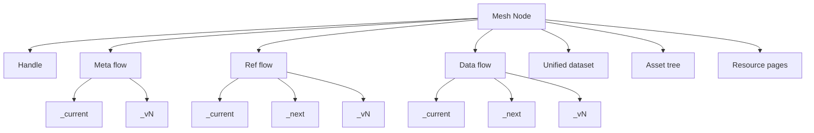

# Semantic Mesh — LLM-Oriented Concept Summary

0)  Twin Purposes

- minting IRIs for referring to things on the semantic web
- holding semantic data or datasets that use those IRIs and support their use.


1) Definition
A semantic mesh is a dereferenceable, folder-structured, possibly-versioned corpus of semantic resources where every URL returns meaningful content. It maps directly from a Git repository’s folder hierarchy to a published static site so that:
- Every mesh resource is addressable by a stable URL.
- Resource folders are dereferenceable by index.html resource pages.
- RDF datasets are maintained as versioned flow snapshots with distributions.
- The weave process keeps the mesh consistent and publish-ready.

1) Design Principles
- Dereferenceability for humans: folder-based URLs return a meaningful HTML page for discovery and context [principle.dereferencability-for-humans](documentation/principle.dereferencability-for-humans.md).
- Single Referent Principle: a given URL identifies exactly one thing (concept vs content clearly separated) [principle.single-referent](documentation/principle.single-referent.md).
- Pseudo-immutability: certain artifacts (e.g., version snapshots, identifiers) are treated as immutable even though a file system cannot enforce it [principle.pseudo-immutability](documentation/principle.pseudo-immutability.md).
- Transposability: meshes remain valid when moved between hosting locations because internal links resolve relatively and publication history can be preserved [concept.transposability](documentation/concept.transposability.md).
- Composability: submeshes can be extracted and composed; weaving resolves broken relatives as needed [concept.composability](documentation/concept.composability.md).

1) Core Abstractions
3.1 Mesh Resources
- Mesh Node: an extensible namespace container represented by a folder; can contain nodes and elements [concept.mesh.resource.node](documentation/concept.mesh.resource.node.md).
  - Namespace node: organizational container [concept.mesh.resource.node.namespace](documentation/concept.mesh.resource.node.namespace.md).
  - Reference node: identifies an external entity and has a reference flow [concept.mesh.resource.node.reference](documentation/concept.mesh.resource.node.reference.md).
  - Data node: identifies the concept of a dataset; its data lives in a data flow and snapshots [concept.mesh.resource.node.data](documentation/concept.mesh.resource.node.data.md).
  - Dataset-series node: an optional specialization indicating a collection of datasets over time [concept.mesh.resource.node.data.series](documentation/concept.mesh.resource.node.data.series.md).
- Mesh Element: terminal mesh resources that define and support node structure and behavior [concept.mesh.resource.element](documentation/concept.mesh.resource.element.md).
  - Flows (DatasetSeries concepts): metadata, reference, data, unified [concept.mesh.resource.element.flow](documentation/concept.mesh.resource.element.flow.md), [concept.mesh.resource.element.flow.metadata](documentation/concept.mesh.resource.element.flow.metadata.md), [concept.mesh.resource.element.flow.reference](documentation/concept.mesh.resource.element.flow.reference.md), [concept.mesh.resource.element.flow.data](documentation/concept.mesh.resource.element.flow.data.md), [concept.mesh.resource.element.flow.unified](documentation/concept.mesh.resource.element.flow.unified.md).
  - Flow snapshots (Dataset instances): _current/, _next/, _vN/; hold distributions [concept.mesh.resource.element.flow.snapshot](documentation/concept.mesh.resource.element.flow.snapshot.md), [concept.mesh.resource.element.flow.snapshot.current](documentation/concept.mesh.resource.element.flow.snapshot.current.md), [concept.mesh.resource.element.flow.snapshot.next](documentation/concept.mesh.resource.element.flow.snapshot.next.md), [concept.mesh.resource.element.flow.snapshot.version](documentation/concept.mesh.resource.element.flow.snapshot.version.md), [concept.mesh.resource.element.flow.snapshot.distribution](documentation/concept.mesh.resource.element.flow.snapshot.distribution.md).
  - Handle: indirection that lets a node be referred to “as a mesh resource” without violating Single Referent [concept.mesh.resource.element.handle](documentation/concept.mesh.resource.element.handle.md).
  - Asset tree: arbitrary static files attached to a node (templates, CSS, images) [concept.mesh.resource.element.asset-tree](documentation/concept.mesh.resource.element.asset-tree.md).
  - Documentation resources: README, CHANGELOG, and resource pages (index.html) [concept.mesh.resource.element.documentation-resource.readme](documentation/concept.mesh.resource.element.documentation-resource.readme.md), [concept.mesh.resource.element.documentation-resource.changelog](documentation/concept.mesh.resource.element.documentation-resource.changelog.md), [concept.mesh.resource.element.documentation-resource.resource-page](documentation/concept.mesh.resource.element.documentation-resource.resource-page.md), [concept.mesh.resource.element.documentation-resource.resource-fragment](documentation/concept.mesh.resource.element.documentation-resource.resource-fragment.md).
  - Aggregated distribution: optional roll-up of child data nodes’ current datasets at the parent node for convenience [concept.mesh.resource.element.aggregated-distribution](documentation/concept.mesh.resource.element.aggregated-distribution.md).

3.2 Folder and File Facets
- Folder facet: folders map to namespace segments and are addressable; reserved folders model system/user elements and dataset snapshots [concept.mesh.resource-facet.folder](documentation/concept.mesh.resource-facet.folder.md).
- File facet: concrete content files such as distributions and docs are directly retrievable [concept.mesh.resource-facet.file](documentation/concept.mesh.resource-facet.file.md).
- Dataset facet: clarifies abstract DatasetSeries vs concrete Dataset; distributions live on snapshots [concept.mesh.resource-facet.dataset](documentation/concept.mesh.resource-facet.dataset.md).

4) Addressing and Identity
4.1 Namespace and Relative Identifiers
- Folder names become namespace segments; the folder path yields the node’s relative identifier and URL path when published.
- Relative identifiers are used within distributions and are resolved relative to their containing distribution’s location [concept.relative-identifier](documentation/concept.relative-identifier.md).
- Namespace overview and segments: [concept.namespace](documentation/concept.namespace.md), [concept.namespace.segment](documentation/concept.namespace.segment.md), [concept.namespace.segment.system](documentation/concept.namespace.segment.system.md) (note: these need completion; see Inconsistencies).

4.2 URL Semantics
- Concept URLs (slash-terminated) identify entities or abstract constructs: namespace nodes, reference nodes, data nodes, abstract datasets, snapshots, handle.
- Content URLs (file extensions) identify retrievable representations: distributions, index.html, README.md, assets.
- Clear referent distinctions prevent document-vs-thing ambiguity [concept.url](documentation/concept.url.md); reference strategies and tradeoffs [concept.url.reference-path-choices](documentation/concept.url.reference-path-choices.md).

4.3 Handle Rationale
- A node’s URL refers to its conceptual referent (namespace, real-world thing, or abstract dataset). The handle element provides a URL to refer to the node as a mesh resource (for config, provenance, lifecycle) [concept.mesh.resource.element.handle](documentation/concept.mesh.resource.element.handle.md) and [handle page](documentation/concept.mesh.resource.element.handle.page.md).

5) Physical Structure and Reserved Folders
- Nodes map to folders; elements are subfolders or files.
- Reserved names begin with an underscore. Canonical examples seen across docs include:
  - _node-handle/
  - Flow containers for abstract datasets: often seen as either _meta-flow/, _ref-flow/, _data-flow/ (component naming) OR as _meta-flow/, _ref-flow/, _data-flow/ (flow naming). See Inconsistencies.
  - Snapshot folders: _current/, _next/, _v1/, _v2/, …
  - _assets/ for static files and optional templates/CSS.

Example: see the end-to-end hierarchy in the worked example [concept.semantic-mesh.example](documentation/concept.semantic-mesh.example.md).

6) Data and Versioning Model
- Only flows are versioned (i.e., DatasetSeries). Nodes themselves are not versioned [concept.versioning](documentation/concept.versioning.md).
- Flow snapshots:
  - _current/ is the stable, published content identical to the latest version snapshot after a weave.
  - _next/ is a mutable working draft area.
  - _vN/ are immutable version snapshots for precise citation and provenance.
- Working distribution guideline: _next typically has just one editable source distribution; weave can fan-out to multiple serializations [concept.working-distribution](documentation/concept.working-distribution.md).

7) Lifecycle and Weave Process
- The weave process maintains the mesh:
  - Ensures required system elements exist.
  - Promotes _next to _current, optionally creating the next _vN snapshot when versioning is enabled.
  - Updates metadata, regenerates resource pages, flags unified datasets for regeneration as needed.
  - Supports interactive modes and tombstoning [concept.weave-process](documentation/concept.weave-process.md).
- Provenance is stored primarily in the metadata flow, with stable fragment IRIs and delegation chains; _current meta may duplicate the latest version’s provenance for stable resolution [concept.metadata.provenance](documentation/concept.metadata.provenance.md).

8) Publishing and Sites
- Mesh repos are ordinary Git repositories. Pushing to GitHub Pages or any static host publishes the site; folder paths map to URL paths [concept.mesh-repo](documentation/concept.mesh-repo.md), [concept.semantic-site](documentation/concept.semantic-site.md), [concept.publication](documentation/concept.publication.md).
- Transposition between domains works because intra-mesh references can be relative and no base is hardcoded [concept.transposability](documentation/concept.transposability.md).

9) Configuration and Inheritance
- Node configuration controls versioning, distribution formats, resource page generation, and more. It is managed through two distinct flows:
  - **Operational Config Flow**: Contains the final, resolved settings for a node. It is the consumer of the inheritance chain.
  - **Inheritable Config Flow**: Contains settings a node provides to its descendants. It is a provider to the inheritance chain.
- A single inheritance mechanism resolves the final operational config by drawing from parent `inheritable` configs, as well as service and platform defaults.
- See [config flows](documentation/concept.mesh.resource.element.flow.config.md), [operational config flow](documentation/concept.mesh.resource.element.flow.config.operational.md), and [inheritable config flow](documentation/concept.mesh.resource.element.flow.config.inheritable.md) for details.

10) Unified and Aggregated Views
- Unified dataset: a system-generated DatasetSeries that aggregates a node’s current state from meta, ref, and data flows into one snapshot for convenience; independently versioned; typically no user-facing _next [concept.mesh.resource.element.flow.unified](documentation/concept.mesh.resource.element.flow.unified.md).
- Aggregated distribution: optional roll-up across contained child nodes’ current data for a parent node [concept.mesh.resource.element.aggregated-distribution](documentation/concept.mesh.resource.element.aggregated-distribution.md).

11) Minimal File Tree Example

```
/repo-root/
├── _assets/                         # templates, css, images for the site or node
├── my-node/                         # a mesh node
│   ├── _node-handle/                # handle
│   ├── _meta-flow/             # metadata flow container (system)
│   │   ├── _current/
│   │   └── _v1/
│   ├── _ref-flow/              # reference flow container (optional)
│   │   ├── _current/
│   │   └── _v1/
│   ├── _data-flow/             # data flow container (for data nodes)
│   │   ├── _current/
│   │   ├── _next/
│   │   └── _v1/
│   ├── index.html                   # resource page
│   ├── README.md
│   └── CHANGELOG.md
└── docs/ or public host mapping     # publication target
```

12) Visual Overview



13) Glossary
- Mesh: the full set of addressable resources in a repository, typically published as a static site [concept.mesh](documentation/concept.mesh.md).
- Mesh Node: an extensible namespace container in a mesh (folder) [concept.mesh.resource.node](documentation/concept.mesh.resource.node.md).
- Mesh Element: a terminal resource that supports nodes; includes flows, snapshots, handle, docs, assets [concept.mesh.resource.element](documentation/concept.mesh.resource.element.md).
- Flow: a DatasetSeries that represents an abstract dataset about a node (meta, ref, data, unified) [concept.mesh.resource.element.flow](documentation/concept.mesh.resource.element.flow.md).
- Flow Snapshot: a concrete dataset instance with distributions (_current, _next, _vN) [concept.mesh.resource.element.flow.snapshot](documentation/concept.mesh.resource.element.flow.snapshot.md).
- Distribution: a concrete file serialization of a dataset (e.g., .trig, .jsonld) [concept.mesh.resource.element.flow.snapshot.distribution](documentation/concept.mesh.resource.element.flow.snapshot.distribution.md).
- Handle: indirection allowing the node to be referenced as a mesh resource [concept.mesh.resource.element.handle](documentation/concept.mesh.resource.element.handle.md).
- Resource Page: index.html for folders to ensure dereferenceability [concept.mesh.resource.element.documentation-resource.resource-page](documentation/concept.mesh.resource.element.documentation-resource.resource-page.md).
- Unified Dataset: system-composed, versioned aggregation of a node’s non-config flows [concept.mesh.resource.element.flow.unified](documentation/concept.mesh.resource.element.flow.unified.md).
- Aggregated Distribution: roll-up across contained nodes’ current data [concept.mesh.resource.element.aggregated-distribution](documentation/concept.mesh.resource.element.aggregated-distribution.md).
- Weave: lifecycle operation that versions, promotes snapshots, regenerates pages, and ensures integrity [concept.weave-process](documentation/concept.weave-process.md).

14) Notable Inconsistencies and Update Recommendations
The following should be reconciled to present a single coherent model. Each issue lists where it appears and a proposed fix.

A. Folder naming: component vs flow
- Issue: Mixed usage of _meta-flow, _ref-flow, _data-flow vs _meta-flow, _ref-flow, _data-flow.
- Evidence:
  - Uses _meta-flow, _ref-flow, _data-flow [concept.semantic-mesh.example.md](documentation/concept.semantic-mesh.example.md:33), [concept.semantic-mesh.example.md](documentation/concept.semantic-mesh.example.md:71).
  - “meta flow folder” path docs imply _meta-flow naming [concept.mesh.resource.folder._meta-flow.md](documentation/concept.mesh.resource.folder._meta-flow.md).
  - Corresponding reference and data “flow folder” pages [concept.mesh.resource.folder._ref-flow.md](documentation/concept.mesh.resource.folder._ref-flow.md), [concept.mesh.resource.folder._data-flow.md](documentation/concept.mesh.resource.folder._data-flow.md).
- Recommendation: Choose exactly one naming convention across docs and code. Prefer “component” or “flow,” but be consistent everywhere, including URL tables and examples. If “component” is chosen, rename flow-folder pages and examples accordingly; if “flow,” update examples and URL table.

B. Unified folder naming
- Issue: _unified-flow vs _unified.
- Evidence:
  - Example shows _unified-flow [concept.semantic-mesh.example.md](documentation/concept.semantic-mesh.example.md:71).
  - Unified doc uses _unified/ as IRI [concept.mesh.resource.element.flow.unified.md](documentation/concept.mesh.resource.element.flow.unified.md:39).
- Recommendation: Standardize on a single folder name. Suggest _unified-flow for parity with other components if “component” naming is selected.

C. URL table uses _meta, not _meta-flow
- Issue: URL semantics table uses _meta/ rather than _meta-flow/.
- Evidence: [concept.url.md](documentation/concept.url.md:21).
- Recommendation: Align the URL table with the standardized folder naming chosen in A.

D. Asset tree metadata location
- Issue: Whether asset trees carry their own meta flow is contradictory.
- Evidence:
  - Folder facet says _meta-flow may be present in asset trees [concept.mesh.resource-facet.folder.md](documentation/concept.mesh.resource-facet.folder.md:26-29).
  - Asset tree page says its metadata should be stored in the closest parent node [concept.mesh.resource.element.asset-tree.md](documentation/concept.mesh.resource.element.asset-tree.md:13).
- Recommendation: Decide one rule. Suggested: Asset trees are terminal and do not have their own meta flows; metadata about the asset tree lives in the parent node’s meta flow. Update folder facet doc accordingly.

E. “Node flow” doc references legacy names
- Issue: References to sflo.concept.* and node-component.* in flow doc.
- Evidence: [concept.mesh.resource.element.flow.md](documentation/concept.mesh.resource.element.flow.md:11-14).
- Recommendation: Update to concept.mesh.resource.element.flow.* naming and current “component vs flow” convention.

F. Incomplete or placeholder docs
- Evidence:
  - [concept.namespace.md](documentation/concept.namespace.md) content is just “t”.
  - [concept.namespace.segment.md](documentation/concept.namespace.segment.md:15) ends mid-sentence.
  - [concept.namespace.segment.system.md](documentation/concept.namespace.segment.system.md:9) incomplete.
  - [concept.naming.md](documentation/concept.naming.md) empty.
  - Folder pages like [concept.mesh.resource.folder.node.md](documentation/concept.mesh.resource.folder.node.md) and [concept.mesh.resource.folder.namespace.md](documentation/concept.mesh.resource.folder.namespace.md) are empty.
- Recommendation: Fill these with concise, concrete definitions and examples consistent with the model summarized here.

G. Dataset facet description is misleading
- Issue: States flows’ “data is stored in their parent node’s metadata flow’s distributions.”
- Evidence: [concept.mesh.resource-facet.dataset.md](documentation/concept.mesh.resource-facet.dataset.md:11-15).
- Recommendation: Correct to: flows are DatasetSeries without distributions; their snapshots are Datasets that hold distributions. The node’s meta flow holds metadata about flows and versioning, not the flows’ data.

H. Flow snapshot “current” semantics conflict
- Issue: One doc implies “current” is the active working state; another says it matches latest version and is stable.
- Evidence:
  - “current represents the stable, published version” [concept.mesh.resource.element.flow.snapshot.current.md](documentation/concept.mesh.resource.element.flow.snapshot.current.md:9-13).
  - “current versions — The active working state” [concept.mesh.resource.element.flow.snapshot.md](documentation/concept.mesh.resource.element.flow.snapshot.md:55-58).
- Recommendation: Adopt the stable definition: _current equals the latest version’s content post-weave; _next is the mutable working draft.

I. Distribution format support table
- Issue: TriG is marked unsupported, yet examples and guidance emphasize TriG.
- Evidence: [concept.mesh.resource.element.flow.snapshot.distribution.md](documentation/concept.mesh.resource.element.flow.snapshot.distribution.md:24-33).
- Recommendation: Update support to reflect reality; TriG and JSON-LD should be first-class supported formats. Clarify the status for TTL, N-Quads, RDF/XML, etc.

J. Stray or incomplete bullets
- Issue: Unfinished list item under Addressing Requirements.
- Evidence: [concept.mesh.md](documentation/concept.mesh.md:105).
- Recommendation: Complete or remove that bullet (likely intended to mention file facet and index.html dereferenceability).

K. Config defaults doc needs concrete property names
- Issue: Defaults listed without property names or shapes.
- Evidence: [concept.mesh.resource.element.node-config-defaults.md](documentation/concept.mesh.resource.element.node-config-defaults.md:9-14).
- Recommendation: Provide explicit JSON-LD terms and examples aligned with the inheritance spec document.

L. Terminology alignment: “component” vs “flow”
- Issue: Documents interchange “component” and “flow” when referring to the abstract dataset containers; readers should not have to translate.
- Recommendation: Decide and enforce one term in titles, folder names, examples, and URL tables.

M. Relative identifier vs config folder naming
- Issue: Mentions “_config-flow” while config doc uses “_config-flow”.
- Evidence: [concept.relative-identifier.md](documentation/concept.relative-identifier.md:26-33) vs [concept.mesh.resource.element.flow.config.md](documentation/concept.mesh.resource.element.flow.config.md:41-46).
- Recommendation: Align to chosen convention and update examples.

15) What to give an LLM as “core context”
If you must keep it minimal, include:
- The definition and principles in sections 1–2.
- The node vs element split and flows vs snapshots in section 3.
- URL semantics in section 4.
- Lifecycle behavior in section 7.
- The reserved folder overview in section 5 with the standardized names after the inconsistencies are resolved.
