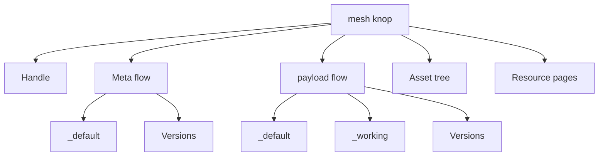

# Semantic Mesh — LLM-Oriented Concept Summary

This document is the canonical, compact context for LLMs. It summarizes all `documentation/concepts.*` notes and cross-links to authoritative pages.

0) Semantic Flow Twin Purposes
- Mint dereferenceable IRIs for referring to things on the Semantic Web
- Hold versionable semantic data that uses those IRIs

1) Definition
A semantic mesh is a dereferenceable, possibly-versioned corpus of semantic resources where every IRI resolves to meaningful content. 

A filesystem-based mesh maps directly from a Git repository’s folder hierarchy to a published static site so that:
- Every resource is addressable by a stable IRI.
- "[[Naming resources|facet.resource.naming]]" are dereferenceable via generated `index.html` resource pages.
- "[[Content resources|facet.resource.content]]" are directly dereferenceable: they should return a file
- RDF datasets live as distributions on versioned flow versions.
- The weave process maintains coherence and keeps the repo publish-ready.

See:
- [[concept.mesh]]: definition, requirements
- [[concept.semantic-flow-site]]: site posture
- [[concept.single-mesh-repo]]: repo-to-site mapping

2) Design Principles
- [[principle.dereferencability-for-humans]]: resource pages
- [[principle.single-referent]]: concept vs content is explicit
- [[principle.pseudo-immutability]]: treat versions/IDs as immutable
- [[principle.transposability]]: move meshes without breaking links via relative IDs
- [[principle.composability]]: extract/compose submeshes

3) Core Abstractions

3.1 Mesh Resources (Nodes and Components)
- Node (folder; container for knops & components): [[mesh-resource.knop]]
  - bare knop: organizational IRI segment container: [[mesh-resource.knop.bare]]
  - payload knop: IRI refers to the knop's referent (real-world entity or dataset concept); has a payload flow: [[mesh-resource.knop.payload]]

- Node component (terminal resource supporting a knop): [[mesh-resource.component]]
  - Flows (abstract datasets as DatasetSeries):
    - Meta flow (metadata/provenance): [[mesh-resource.component.flow.metadata]]
    - payload flow (payload data): [[mesh-resource.component.flow.payload]]
    - config flows (settings; see §9):
      - [[mesh-resource.component.flow.operational-config]]
      - [[mesh-resource.component.flow.inheritable-config]]
  - FlowSlices (concrete Datasets): `_default/`, `_working/`, version folders (e.g., `2025-11-24_0142_07_v1/`)
    - Overview: [[mesh-resource.component.slice]]
    - `_default/`: [[mesh-resource.component.slice.default]]
    - `_working/`: [[mesh-resource.component.slice.working-slice]]
    - Version folders: [[mesh-resource.component.slice.version]]
    - Distributions: [[mesh-resource.component.distribution]]
  - Handle (refer to the knop “as a mesh resource”): [[mesh-resource.component.knop-handle]]
    - Handle page (human-facing): [[mesh-resource.component.knop-handle.page]]
  - Asset tree (static files for the knop): [[mesh-resource.component.asset-tree]]
  - Documentation resources (README/CHANGELOG/resource pages/fragments):
    - README: [[mesh-resource.component.documentation-resource.readme]]
    - CHANGELOG: [[mesh-resource.component.documentation-resource.changelog]]
    - Resource page (index.html): [[mesh-resource.component.documentation-resource.resource-page]]
    - Resource fragment: [[mesh-resource.component.documentation-resource.resource-fragment]]
  - Aggregated distribution (optional roll-up of child knop data): [[mesh-resource.component.aggregated-distribution]]

3.2 Facets (Folder, File, Dataset)
- Folder facet (namespace mapping; reserved folders): [[facet.filesystem.folder]]
- File facet (content retrieval): [[facet.filesystem.file]]
- Dataset facet (DatasetSeries vs Dataset): [[facet.resource.dataset]]

1) Addressing and Identity

4.1 Namespace and Relative Identifiers
- Folder names become namespace segments; the path is the knop’s relative identifier (and IRI path when published).
- Relative identifiers are used within distributions for transposability; resolve relative to distribution location.
See:
- [[concept.namespace]]: overview
- [[concept.namespace.segment]]: segment definition
- [[concept.namespace.segment.system]]: reserved segments
- [[concept.identifier.intramesh.relative]]: relative IDs

4.2 IRI Semantics
- Concept IRIs (slash-terminated) identify knops, flows (abstract), versions (conceptual), and handle.
- Content IRIs (with filenames) identify retrievable files: distributions, HTML pages, READMEs, assets.
- Follow document-vs-thing hygiene to avoid ambiguity.
See:
- [[concept.identifier]]: IRI types and mapping
- [[faq.reference-iri-choices]]: trade-offs
- [[concept.iri]]: terminology; prefer “IRIs” when referring to mesh-local IRIs

4.3 Handle Rationale
- A knop’s IRI refers to its referent (namespace, real-world entity, or dataset concept).
- The handle component provides a IRI to refer to the knop itself “as a mesh resource” (for config, provenance, lifecycle).
See:
- [[mesh-resource.component.knop-handle]]
- [[mesh-resource.component.knop-handle.page]]

5) Physical Structure and Reserved Folders

Reserved folder names (underscore-prefixed; canonical set):
- `_knop-handle/`
- Flow containers (abstract datasets):
  - `_meta/`, `_payload/`
  - `_cfg-op/`, `_cfg-inh/` (see §9)
- FlowSlices inside a flow:
  - `_default/`, `_working/`, version folders with format `YYYY-MM-DD_HHMM_SS_vN/` (e.g., `2025-11-24_0142_07_v1/`, `2025-11-24_0142_08_v2/`, …)
- Assets:
  - `_assets/` (static files)

Folder-note pages for these reserved names live under `folder.*.md` (where defined):
- `_meta/`: [[folder._meta]]
- `_payload/`: [[folder._payload-flow]]
- `_cfg-op/`: [[folder._cfg-op]]
- `_cfg-inh/`: [[folder._cfg-inh]]
- `_default/`: [[folder._default]]
- `_working/`: [[folder._working]]
- Version folders (`YYYY-MM-DD_HHMM_SS_vN/`): [[folder.flowslice]]
- `_assets/`: [[folder._assets]]
- knop folder pages:
  - Node: [[folder.knop]]

6) Data and Versioning Model
- Only flows are versioned (flows are DatasetSeries). Nodes are not versioned.
- FlowSlices (flow realizations):
  - `_default/`: latest stable realization; after weave it equals the content of the latest version.
  - `_working/`: mutable working area.
  - Version folders (format `YYYY-MM-DD_HHMM_SS_vN/`): immutable history for precise citation and provenance.
- Working distribution: `_working/` typically contains a single editable source; weave can fan-out serializations.
- Sibling distribution: patterns and constraints for multi-file realizations.
See:
- [[concept.flow-version]]
- [[mesh-resource.component.distribution.working]]
- [[concept.sibling-distribution]]

7) Lifecycle and Weave Process
Weave maintains structural coherence and publication readiness:
- Ensures required system components exist.
- If versioning is enabled, creates a new version folder (format `YYYY-MM-DD_HHMM_SS_vN/`) from `_working/`.
- Promotes `_working/` contents to `_default/`.
- Updates meta/provenance; regenerates resource pages.
- Resolves internal links to maintain transposability.
- Integrates with the scanner where applicable.
See:
- [[concept.weave-process]]
- [[concept.weave-process.resource-page-generation]]
- [[concept.scanner]]
- [[concept.metadata.provenance]]

8) Publishing and Sites
- Repos are static-site-ready; pushing to GitHub Pages or any static host publishes the mesh (folder paths → IRI paths).
- Transposition (domain/project move) is safe with relative IDs.
See:
- [[concept.single-mesh-repo]]
- [[concept.semantic-flow-site]]
- [[concept.publication]]

1) Configuration and Inheritance (Two Config Flows)
- Operational Config Flow: final, resolved settings for a knop (consumer). Overrides apply here.
- Inheritable Config Flow: settings a knop offers to descendants (provider). Property-level merge; order: parent → … → service → platform; propagation can be firewalled.
- Resolution: a single inheritance mechanism resolves operational config from inheritable configs plus service/platform defaults. Explicit operational entries override inherited ones.
See:
- [[concept.knop-config]]: overview
- [[mesh-resource.component.flow.operational-config]]
- [[mesh-resource.component.flow.inheritable-config]]
- [[concept.knop-config.defaults]]: defaults 

1)  Aggregated Views
- Aggregated distribution: optional roll-up of child payload knops’ default datasets at a parent knop for convenience.
See:
- [[mesh-resource.component.aggregated-distribution]]

1)  Minimal File Tree Example

```
/repo-root/
├── _assets/                         # optional site-wide assets
├── my-knop/                         # a mesh knop (folder)
│   ├── _knop-handle/                # handle component (resource.knop-component.knop-handle)
│   ├── _meta/                  # metadata flow (system)
│   │   ├── _default/
│   │   └── 2025-11-24_0142_07_v1/
│   ├── _payload/                  # payload flow (for payload knops)
│   │   ├── _default/
│   │   ├── _working/
│   │   └── 2025-11-24_0142_07_v1/
│   ├── _cfg-inh/    # provider config (optional)
│   ├── _cfg-op/    # resolved config (optional; may be system-written)
│   ├── index.html                   # resource page
│   ├── README.md
│   └── CHANGELOG.md
└── docs/ or public host mapping     # publication target
```

12) Visual Overview


```mermaid
graph TD
  A[mesh knop] --> B[Handle]
  A --> C[Meta flow]
  A --> E[payload flow]
  A --> G[Asset tree]
  A --> H[Resource pages]

  C --> C1[_default]
  C --> C2[Versions]
  E --> E1[_default]
  E --> E2[_working]
  E --> E3[Versions]
```

13) Glossary
- [[concept.mesh]]: the set of addressable resources in a repository, published as a site
- [[mesh-resource.knop]]: an extensible  resource containing other knops and its own components
- [[mesh-resource.component]]: terminal resource that supports knop behavior/structure
- [[mesh-resource.component.flow]]: DatasetSeries representing an abstract dataset (meta/data/config)
- [[mesh-resource.component.slice]]: concrete Dataset realization of a flow (Version, DefaultSlice, WorkingSlice)
- [[mesh-resource.component.distribution]]: a concrete serialization file (TriG, JSON-LD, etc.)
- [[mesh-resource.component.knop-handle]]: indirection to refer to the knop "as a mesh resource"
- [[mesh-resource.component.documentation-resource.resource-page]]: dereferenceable `index.html` for folders
- [[concept.weave-process]]: lifecycle operation to version/promote/regenerate/repair
